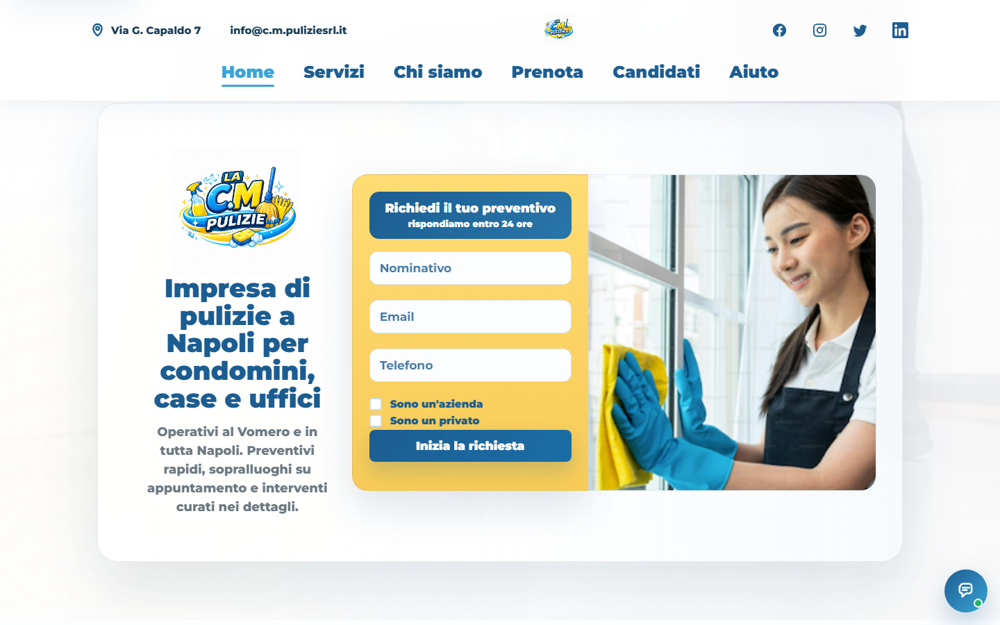
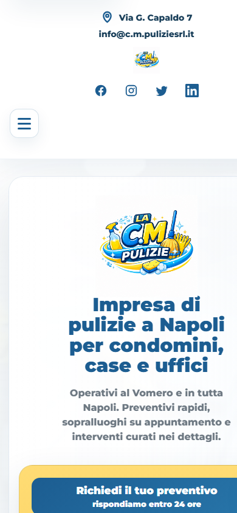
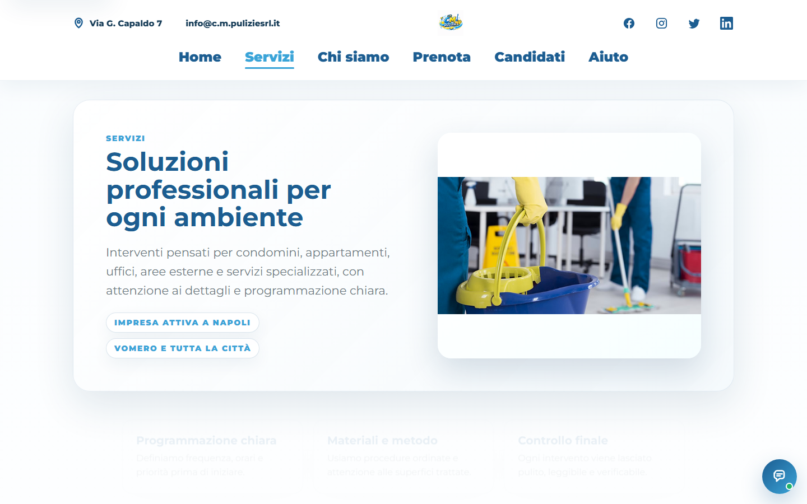
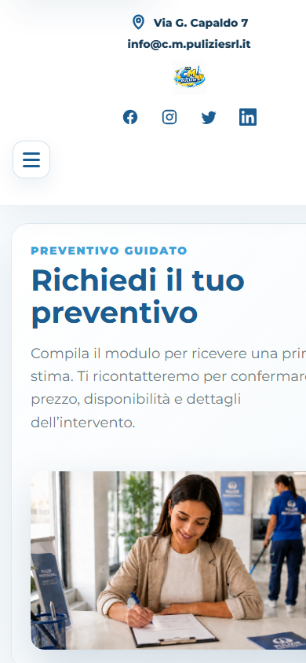
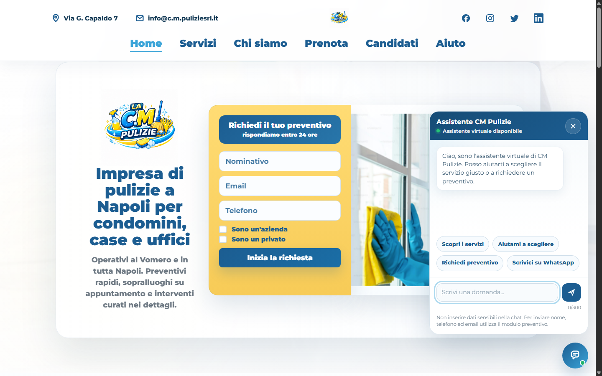
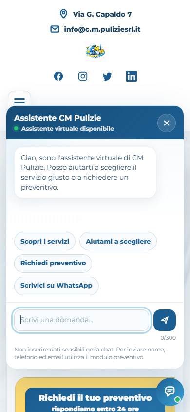

# C.M. Pulizie - Sito aziendale responsive

[Visualizza la demo online](https://vincenzomec97-ship-it.github.io/cm-pulizie/)

Progetto frontend realizzato per presentare i servizi di un'impresa di pulizie e semplificare la richiesta di preventivo. Il sito include un preventivo dinamico diverso per ogni servizio, un assistente virtuale con risposte controllate, integrazione WhatsApp, animazioni leggere e un'interfaccia completamente responsive.

## Stato del progetto

Il progetto e pubblicato in modalita portfolio. Le integrazioni con database, email, PDF e account aziendali sono predisposte concettualmente, ma non sono attive nella demo pubblica.

La modalita portfolio e dichiarata in:

```json
{
  "mode": "portfolio"
}
```

File principali di configurazione:

- `data/site-config.json`
- `assets/js/config.js`
- `CONFIG.md`

## Problema affrontato

Il sito doveva:

- presentare diversi servizi in modo semplice;
- funzionare bene da smartphone;
- aiutare il cliente a scegliere il servizio corretto;
- raccogliere dati diversi per uffici, condomini, appartamenti e altri interventi;
- portare il cliente verso il preventivo o WhatsApp;
- mantenere uno stile aziendale professionale.

## Soluzione realizzata

- Home aziendale con hero, immagine principale, form iniziale e call to action.
- Pagina servizi con card, descrizioni e immagini.
- Contatori animati e micro-animazioni leggere.
- Recensioni dimostrative per mostrare il layout della sezione.
- Preventivo dinamico con campi specifici per servizio.
- Assistente virtuale con risposte controllate.
- Pulsanti WhatsApp.
- Responsive design per desktop, tablet e smartphone.
- Accessibilita di base e SEO tecnica.
- Modalita demo sicura per portfolio.

## Funzionalita principali

1. Layout responsive.
2. Navigazione desktop e mobile.
3. Preventivo differenziato per servizio.
4. Campi dinamici.
5. Riepilogo della stima.
6. Chatbot con FAQ controllate.
7. Pulsanti WhatsApp.
8. Animazioni leggere.
9. Gestione degli errori.
10. Privacy e modalita demo.
11. Pagina 404.
12. SEO tecnica.

## Preventivo dinamico

Il preventivo non e un modulo generico. Il modulo cambia in base al servizio scelto:

- Pulizie condomini.
- Pulizie appartamenti.
- Pulizie uffici.
- Sanificazione ambienti.
- Disinfestazione.
- Giardinaggio.

Ogni percorso mostra domande e campi specifici. La stima resta indicativa e nella demo portfolio non viene inviata ne salvata.

## Assistente virtuale

L'assistente virtuale non utilizza AI esterna. Usa risposte controllate definite in `data/chatbot-config.json`.

Il chatbot:

- non inventa prezzi;
- non conferma appuntamenti;
- indirizza verso preventivo e WhatsApp;
- funziona in modo sicuro in un progetto statico;
- non salva conversazioni o dati personali.

## Tecnologie utilizzate

- HTML5.
- CSS3.
- JavaScript.
- JSON.
- GitHub Pages.

## Responsive design

Il sito e stato verificato per smartphone, tablet, desktop, dispositivi touch e orientamenti verticale/orizzontale. Le card, le immagini, il form preventivo, il menu mobile, il chatbot e il footer sono stati controllati per evitare sovrapposizioni e scorrimento orizzontale.

## Accessibilita

Nel progetto sono presenti:

- lingua italiana nel tag `html`;
- navigazione da tastiera;
- focus visibile;
- `aria-label` sui controlli principali;
- `aria-expanded` su menu mobile e chat;
- testi alternativi per le immagini;
- contrasto leggibile;
- rispetto di `prefers-reduced-motion`;
- campi modulo con label.

Non viene dichiarata una conformita WCAG completa, ma il progetto include attenzioni concrete per rendere l'esperienza piu accessibile.

## Sicurezza della demo

La demo pubblica e navigabile e mostra il comportamento del preventivo dinamico senza inviare dati reali.

- Nessun dato personale viene inviato.
- Nessuna richiesta viene salvata in database.
- Nessuna email automatica viene inviata.
- Nessun PDF con dati personali viene caricato online.
- Nessuna API privata o credenziale e presente nel frontend.
- Nessuna conversazione della chat viene salvata.
- Nessun analytics e attivo.
- La pagina admin resta una demo grafica e non mostra dati reali.

Quando il form viene completato in modalita portfolio, il sito mostra:

> Questa e una versione dimostrativa del progetto. La richiesta non e stata inviata ne salvata.

## Recensioni dimostrative

Le recensioni presenti nella demo sono contenuti dimostrativi utilizzati per mostrare il layout della sezione. Non vengono presentate come recensioni Google o recensioni verificate.

## Screenshot

Gli screenshot reali della demo sono in `docs/screenshots/`.

- `home-desktop.png`
- `home-mobile.png`
- `servizi-desktop.png`
- `preventivo-mobile.png`
- `chatbot-desktop.png`
- `chatbot-mobile.png`








Dimensioni consigliate per nuove acquisizioni:

- desktop: 1440 x 900;
- mobile: 390 x 844.

## Evoluzione futura

Il progetto puo essere collegato in futuro a:

- dominio aziendale;
- email professionali;
- Profilo dell'attivita Google;
- PagineGialle;
- Google Search Console;
- Google Sheet o database;
- Google Apps Script;
- email automatiche;
- PDF preventivi;
- area amministrativa protetta;
- recensioni reali;
- Analytics, dopo configurazione privacy.

Queste integrazioni non sono attive nella demo pubblica.

## Come eseguire il progetto

Puoi aprire `index.html` direttamente nel browser. Per testare al meglio il caricamento dei file JSON, usa un server locale:

```bash
python -m http.server 8000
```

Poi apri:

```text
http://localhost:8000/
```

Node non e necessario per pubblicare o visualizzare il sito.

## Configurazione contatti e modulo

Per modificare telefono, WhatsApp, email, indirizzo, URL del sito o endpoint del modulo, aggiorna `assets/js/config.js`.

La demo usa:

```js
mode: "portfolio"
formEndpoint: ""
```

Con questa configurazione nessun dato viene inviato o salvato. Per una versione reale bisogna collegare un endpoint sicuro, ad esempio Google Apps Script o un backend serverless, senza inserire credenziali nel codice pubblico.

Il file `CONFIG.md` elenca i dati aziendali e privacy da verificare prima della pubblicazione definitiva.

## Struttura delle cartelle

```text
.
|-- assets/
|   |-- css/
|   |-- img/
|   `-- js/
|-- apps-script/
|-- data/
|-- docs/
|   `-- screenshots/
|-- index.html
|-- servizi.html
|-- chi-siamo.html
|-- prenota.html
|-- candidati.html
|-- aiuto.html
|-- privacy.html
|-- admin.html
|-- 404.html
|-- style.css
|-- script.js
|-- robots.txt
`-- sitemap.xml
```

## File principali

- `index.html` - homepage.
- `servizi.html` - pagina servizi.
- `chi-siamo.html` - pagina aziendale.
- `prenota.html` - preventivo dinamico.
- `candidati.html` - form candidatura demo.
- `aiuto.html` - FAQ.
- `privacy.html` - informativa privacy.
- `admin.html` - demo grafica area richieste, noindex.
- `script.js` - animazioni, preventivo dinamico, modalita portfolio e admin demo.
- `assets/js/chatbot.js` - assistente virtuale controllato.
- `assets/js/config.js` - configurazione contatti, modalita e URL.
- `data/chatbot-config.json` - FAQ e risposte del chatbot.
- `data/preventivo-config.json` - configurazione dei servizi.
- `data/site-config.json` - modalita portfolio.

## Futuro collegamento produzione

Il file `apps-script/Code.gs` resta come traccia tecnica per una futura integrazione con Google Apps Script. Per una versione reale servirebbero:

- URL Web App Google Apps Script;
- email reale del titolare;
- token admin salvato in Script Properties o in un sistema sicuro;
- informativa privacy definitiva;
- protezione reale dell'area admin.

Non inserire password, API key o token nel repository pubblico.

## Autore

- Nome: Vincenzo Meccariello
- Portfolio: INSERIRE_LINK_PORTFOLIO
- GitHub: INSERIRE_LINK_GITHUB
- LinkedIn: INSERIRE_LINK_LINKEDIN
- Email professionale: INSERIRE_EMAIL_PROFESSIONALE
